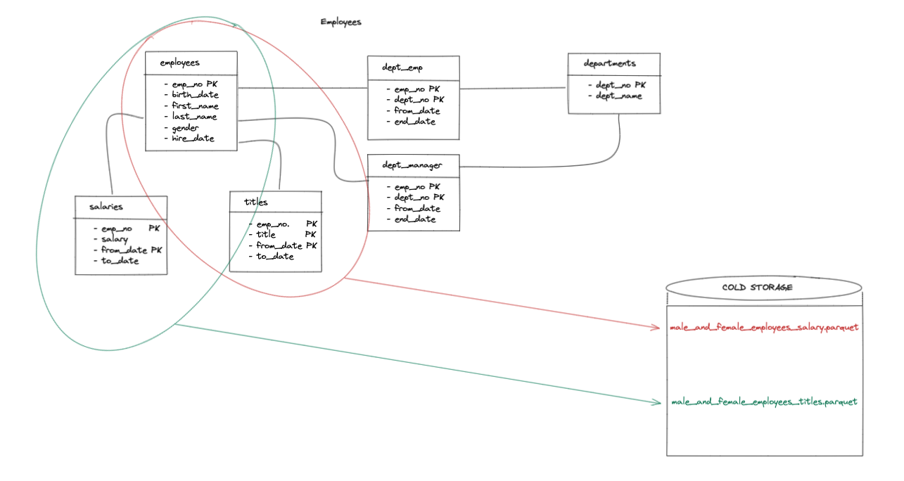

## Denormalization

In computing, denormalization is the process of trying to improve the read performance of a database, at the expense of losing some write performance, by adding redundant copies of data or by grouping data

Let's try to apply this paradigm using Spooq



### Init example db

1. git clone https://github.com/datacharmer/test_db
2. docker run --name my-mysql -e MYSQL_ROOT_PASSWORD=password -d -p 3306:3306 mysql
3. docker cp test_db my-mysql:/tmp 
4. docker exec -it my-mysql bash
5. cd /tmp/test_db/ 
6. mysql -ppassword < employees.sql 
7. mysql -ppassword -t < test_employees_md5.sql
8. exit

### Spooq 

Configuration file: conf/denormalize.conf
Output files: data/*.parquet

### Run Example

Execute the script

```
export SPARK_HOME=<your local spark home>
sh run.sh
``` 

### How to works?

```(json)
id = "Denormalize data"
desc = """

Denormalize data to save into a cold storage (parquet)

Note: in your system mysql ip should be different!!! 
"""
steps = [
    {
        id = employees_table
        shortDesc = "read employees table from jdbc"
        kind = input
        format = jdbc
        options = {
            url = "jdbc:mysql://192.168.1.15:3306/employees"
            driver = "com.mysql.cj.jdbc.Driver"
            dbtable = "employees.employees"
            user = "root"
            password = "password"
        }
    },
    {
        id = salaries_table
        shortDesc = "read salaries table from jdbc"
        kind = input
        format = jdbc
        options = {
            url = "jdbc:mysql://192.168.1.15:3306/employees"
            driver = "com.mysql.cj.jdbc.Driver"
            dbtable = "employees.salaries"
            user = "root"
            password = "password"
        }
    },
    {
        id = titles_table
        shortDesc = "read titles table from jdbc"
        kind = input
        format = jdbc
        options = {
            url = "jdbc:mysql://192.168.1.15:3306/employees"
            driver = "com.mysql.cj.jdbc.Driver"
            dbtable = "employees.titles"
            user = "root"
            password = "password"
        }
    },
    {
        id = male_employees
        shortDesc = "Only male employees"
        kind = sql
        sql = "select * from employees_table where gender = 'M'"
        cache = true
    },
    {
        id = female_employees
        shortDesc = "Only female employees"
        kind = sql
        sql = "select * from employees_table where gender = 'F'"
        cache = true
    },
    {
        id = male_employees_salary
        shortDesc = "male employees salaries"
        kind = sql
        sql = "select e.first_name, e.last_name, e.gender, e.birth_date, s.salary, s.from_date, s.to_date from male_employees e join salaries_table s on e.emp_no = s.emp_no "
    },
    {
        id = female_employees_salary
        shortDesc = "female employees salaries"
        kind = sql
        sql = "select e.first_name, e.last_name, e.gender, e.birth_date, s.salary, s.from_date, s.to_date from female_employees e join salaries_table s on e.emp_no = s.emp_no "
    },
    {
        id = male_and_female_employees_salary
        shortDesc = "union data"
        kind = sql
        sql = "(select a.* from male_employees_salary as a) union (select b.* from female_employees_salary as b)"
    },
    {
        id = male_employees_titles
        shortDesc = "male employees titles"
        kind = sql
        sql = "select e.first_name, e.last_name, e.gender, e.birth_date, t.title, t.from_date , t.to_date from male_employees e join titles_table t on e.emp_no = t.emp_no"
    },
    {
        id = female_employees_titles
        shortDesc = "female employees titles"
        kind = sql
        sql = "select e.first_name, e.last_name, e.gender, e.birth_date, t.title, t.from_date , t.to_date from female_employees e join titles_table t on e.emp_no = t.emp_no"
    },
    {
        id = male_and_female_employees_titles
        shortDesc = "union data"
        kind = sql
        sql = "(select a.* from male_employees_titles as a) union (select b.* from female_employees_titles as b)"
    },
    {
        id = out_salary
        shortDesc = "write to fs"
        desc = "write 'male_and_female_employees_salary' table to fs using parquet format"
        kind = output
        source = male_and_female_employees_salary
        format = parquet
        mode = overwrite
        path = "data/male_and_female_employees_salary.parquet"
    },
    {
        id = out_titles
        shortDesc = "write to fs"
        desc = "write 'male_and_female_employees_titles' table to fs using parquet format"
        kind = output
        source = male_and_female_employees_titles
        format = parquet
        mode = overwrite
        path = "data/male_and_female_employees_titles.parquet"
    }
]
```

The Scoop configuration file consists of 4 steps:
 - three jdbc: to load tables inside spark context
 - more sql: to extract and join data
 - two output parquet: to write data into cold storage

